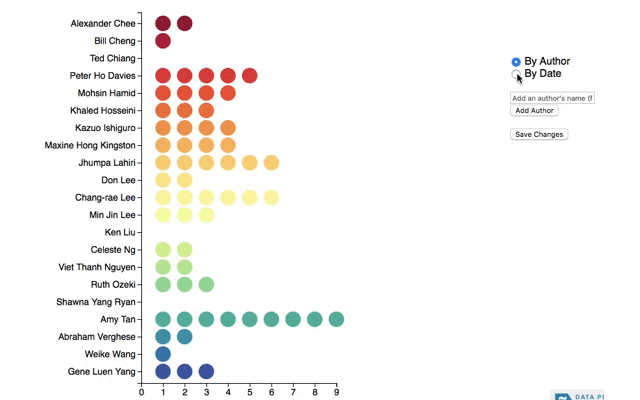

# wiki-graph
A framework for editing the data of data driven graphs

## About
This project was created in the hope of making the data that a graph pulls from transparent. The example that it uses is a list of Asian American authors. This list was sent through the [New York Times book reviews API](https://developer.nytimes.com/books_api.json) and returns a list of books the NYT has reviewed by that author.

This data is fed into a data driven graph (powered by [D3](https://d3js.org/)) which shows the number of reviews each author has, and can also toggle to display the dates in which the reviews were published.



So far the pipeline looks like this:


This is nice if we know we already have the list of all Asian American authors. But since this was a list I put together alone, it is certainly not complete. And since there isn't a definitive list of Asian American authors out there, the best way to create a comprehensive list seems to be to go the Wikipedia route, where a community reaches a consensus through continuous, collaborative editing.

Hence, wikigraphs!


In this model, a user can add and delete the data driver (the author name). The collection means is still automated (querying the NYT API) and the graph will automatically update to reflect the changes.


Changes made are saved to a database, and therefore the graph represents a collective idea about the topic (in this case, who is an Asian American author).

## Tech
* Flask
* MongoDB
* D3.js

## Running
Prerequisites:
* MongoDB
* NYT API developer key

Create your own `config_file.cfg` file that has the text:
```
NYT_API_KEY='your key here'
```

In a virtual environment:
```
# install the requirements
pip install -r requirements.txt

# seed the database
python app/db/seeds.py

# run flask
export FLASK_APP=wikigraph.py
flask run
```

## Improvements
* Show log of changes-- which authors have been added and deleted in the past
* Ability to add separate graphs for other topics-- e.g. African American, Science Fiction, Fantasy...
* Incorporate other data sources-- GoodReads API?
