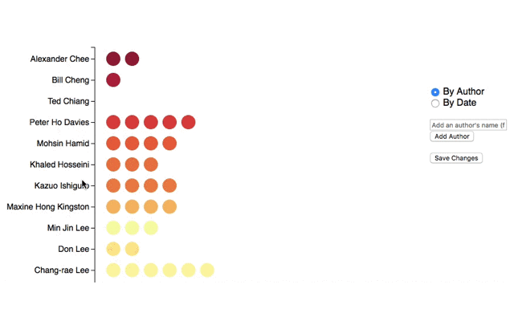

# wiki-graph
A framework for editing the data of data driven graphs

## About
This project was created in the hope of making the data that a graph pulls from transparent. The example that it uses is a list of Asian American authors.

